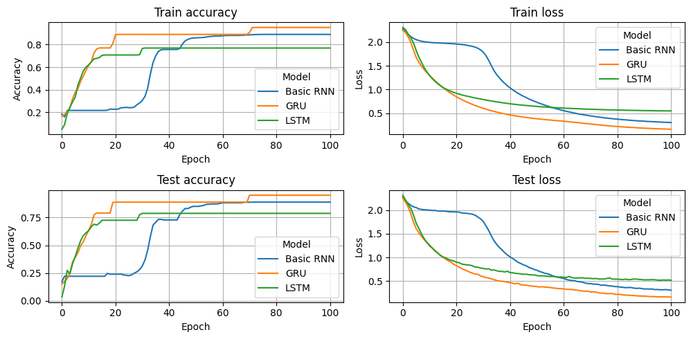
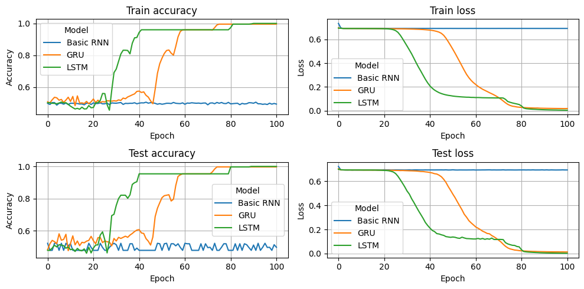
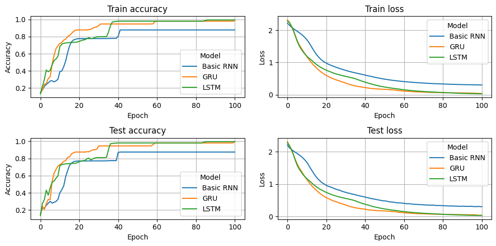
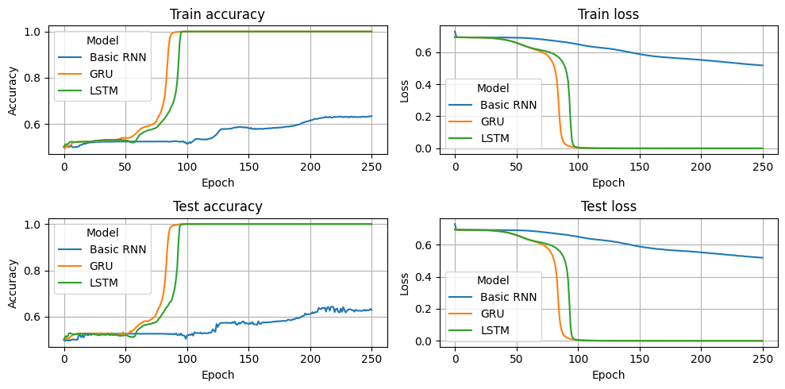
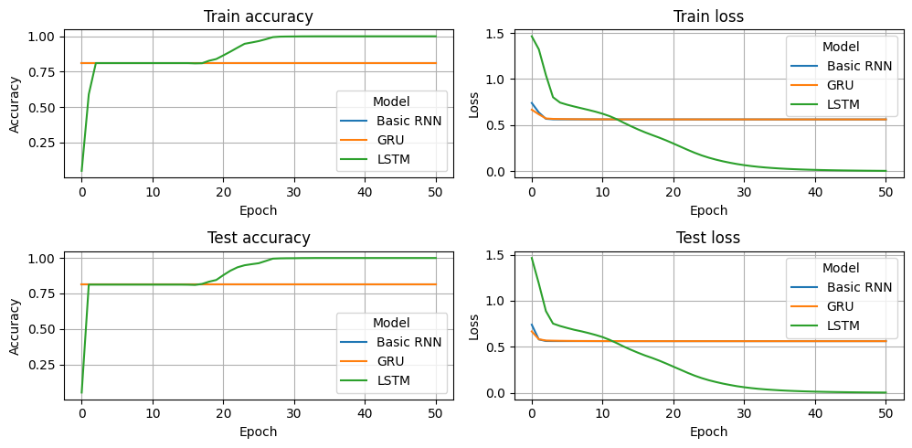

# RNN Workshop

This repository contains tasks for RNNs (listed below) which are easy to solve and fast to implement.

## Many-to-One

### Predict total sum

For each time step, a number (one hot encoded) is passed to the RNN. 
The RNN must predict at the end, the total sum (one hot encoded) of these numbers.
Every sequence has a fixed length.

### Predict total sum odd or even?

For each time step, a number (one hot encoded) is passed to the RNN. 
The RNN must predict at the end, if the total sum of these numbers is odd or even.
Every sequence has a fixed length.

## Many-to-Many 

### Predict current sum

For each time step, a number (one hot encoded) is passed to the RNN. 
The RNN must predict during each time step, the current total sum (one hot encoded) of these numbers.
Every sequence has a fixed length.

### Predict current sum odd or even?

For each time step, a number (one hot encoded) is passed to the RNN. 
The RNN must predict during each time step, if current total sum of these numbers is even or odd.
Every sequence has a fixed length.

### Counting

For each time step, a number in the range of 0 to 2 (inclusive) (one hot encoded) is passed to the RNN. 
These numbers must be counted by the network i.e. if the network encountered a number three times then it must predict it as its output (one hot encoded).
After the network encountered a number three times, the counter for the number is reseted.
Every sequence has a fixed length.

